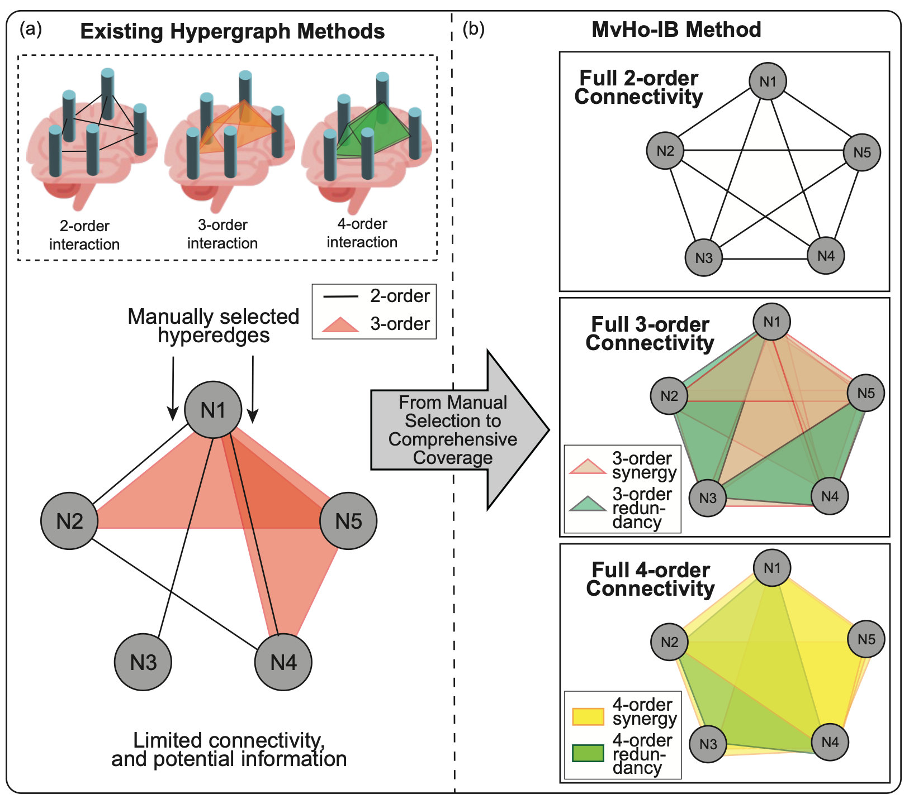
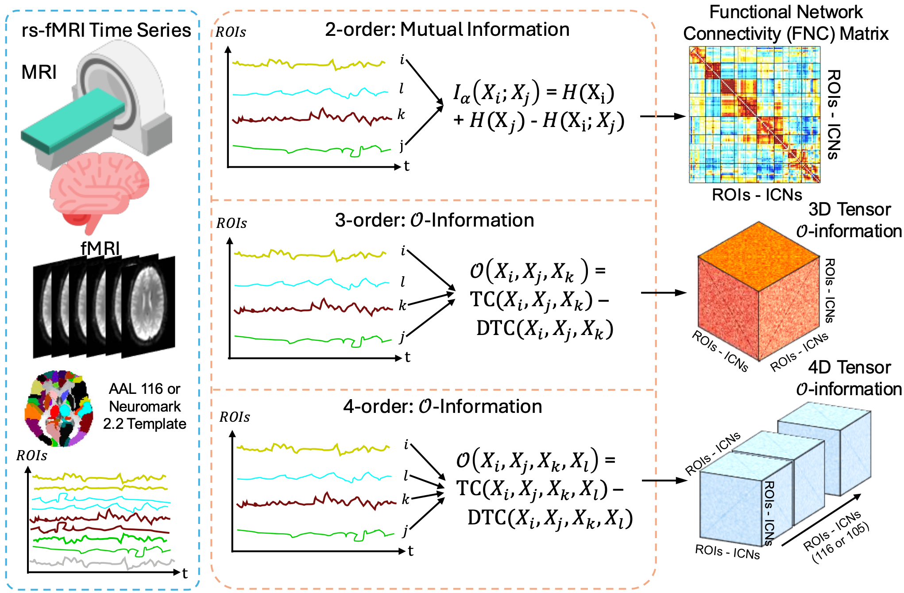
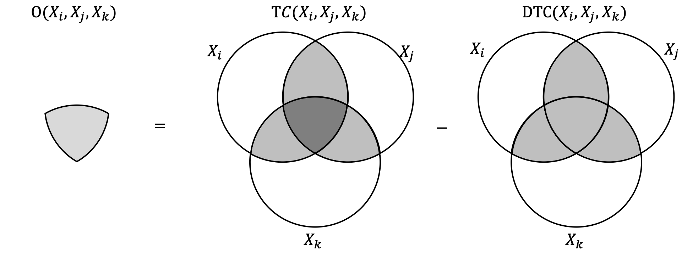
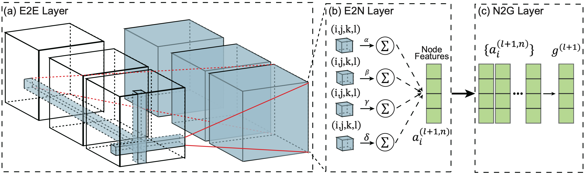

# MvHo-IB++: Modeling Higher-Order Brain Interactions via a Multi-View Information Bottleneck Framework for fMRI-based Psychiatric Diagnosis

<div align="center">

</div>

Code for **Modeling Higher-Order Brain Interactions via a Multi-View Information Bottleneck Framework for fMRI-based Psychiatric Diagnosis** (extended from [MvHo-IB](https://github.com/zky04/MvHo-IB/)).

## 📋 Overview

<p align="center">
  
</p>
The motivation of MvHo-IB++: compared with pairwise graph/hypergraph-style modeling, psychiatric fMRI analysis benefits from explicitly modeling higher-order interactions, where group-level dependencies cannot be reduced to simple pairwise relations.


The data construction pipeline. From each subject, we build three complementary views: a Renyi-MI-based pairwise graph (top-30% sparsification), a third-order O-information tensor, and a fourth-order O-information tensor.


Full MvHo-IB++ architecture. The three views are encoded by GIN, Brain3DCNN, and Brain4DCNN, then fused for diagnosis under information bottleneck regularization to improve representation quality and generalization.

MvHo-IB++ extends MvHo-IB from two-view modeling to **three-view modeling**:

- **View 1 (2D):** pairwise connectivity matrix/graph from matrix-based Renyi mutual information (with top-30% sparsification)
- **View 2 (3D):** third-order O-information tensor
- **View 3 (4D):** fourth-order O-information tensor

Three encoders are used respectively: **GIN**, **Brain3DCNN**, and **Brain4DCNN**. Their latent representations are fused for final diagnosis under information bottleneck regularization.

<p align="center">
  
</p>
This figure gives an intuition of O-information by highlighting redundancy-synergy organization among multiple variables, explaining why modeling 3rd- and 4th-order interactions can provide complementary signals beyond pairwise connectivity.

## 📊 Supported Datasets

- **[ABIDE](https://fcon_1000.projects.nitrc.org/indi/abide/abide_I.html)**
- **[REST-meta-MDD](https://rfmri.org/REST-meta-MDD)**
- **[ADNI](https://adni.loni.usc.edu/)**
- **UCLA**

## 🛠️ Requirements

- Python 3.8+
- PyTorch 1.10+
- PyTorch Geometric
- NumPy, scikit-learn, PyYAML, tqdm

## 📦 Installation

```bash
git clone <your-repo-url>
cd MvHo-IB++
pip install -r requirements.txt
pip install torch-geometric
```

## 🎯 Quick Start

### 1. Prepare Data

Prepare or precompute the three views for each dataset:

- `x1_[dataset].pt`: View-1 graph data (Renyi-MI based)
- `x2_o3_[dataset].pt`: View-2 3D O-information tensor
- `x3_o4_[dataset].pt`: View-3 4D O-information tensor

Example structure:

```text
dataset/
├── ucla/
│   ├── x1_ucla.pt
│   ├── x2_o3_ucla.pt
│   └── x3_o4_ucla.pt
└── adni/
    ├── x1_adni.pt
    ├── x2_o3_adni.pt
    └── x3_o4_adni.pt
```

### 2. Configure Experiment

Edit `config.yaml`:

- `dataset_name`
- `datasets.<name>.x1_path/x2_path/x3_path`
- training / IB / ablation settings

### 3. Run Precomputation (Optional)

```bash
python compute.py --method gauss --dataset ucla --order both --build-graph
```

### 4. Run Training

```bash
python main.py --config config.yaml
```

## 🧠 BrainCNN Architecture



MvHo-IB++ includes both **Brain3DCNN** (for 3D tensors) and **Brain4DCNN** (for 4D tensors) for high-order interaction modeling.

## 📁 Project Structure

```text
MvHo-IB++/
├── main.py
├── compute.py
├── config.yaml
├── methodology.tex
├── src/
│   ├── models/
│   │   ├── gin_model.py
│   │   ├── brain3dcnn.py
│   │   ├── brain4dcnn.py
│   │   └── fusion_model.py
│   ├── data/
│   │   ├── io_mat.py
│   │   ├── graph_builder.py
│   │   ├── dataset.py
│   │   └── data_loader.py
│   ├── trainer/
│   │   └── trainer.py
│   └── utils/
│       ├── config_utils.py
│       ├── info_bottleneck.py
│       └── oinfo_compute.py
├── dataset/
└── computed/
```
